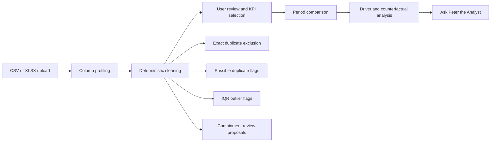
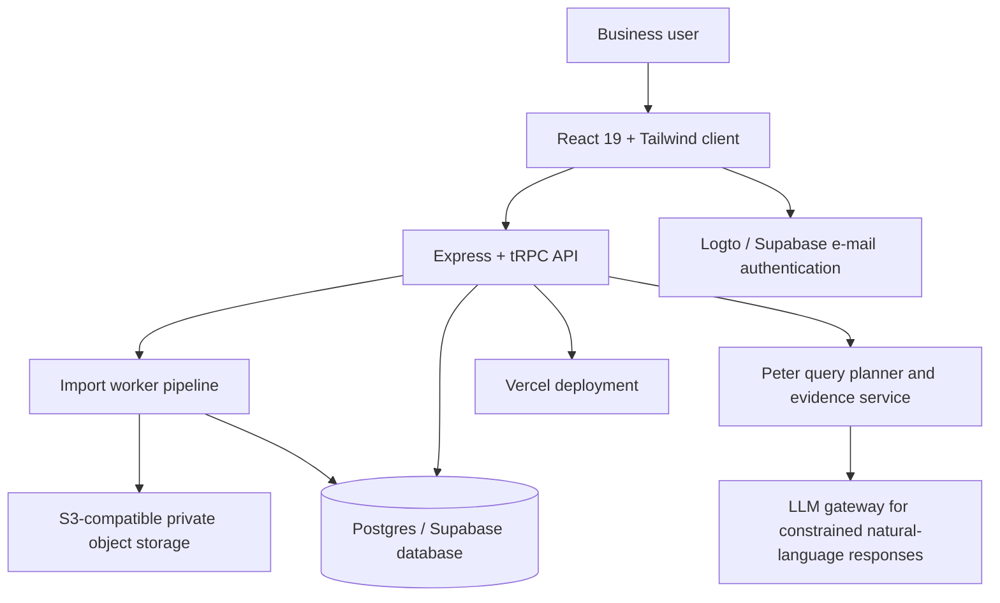

# KPI Detective

> **Turn a messy spreadsheet into a clear, evidence-backed explanation of what moved your business KPI.**

[](https://kpi-detective.vercel.app/)
[](https://www.typescriptlang.org/)
[](https://react.dev/)
[](#license)

**KPI Detective** is an AI-assisted KPI investigation app for non-technical business owners. Upload a CSV or XLSX export, review the cleaning decisions, select the KPI that matters, and receive a plain-English explanation of the latest period-over-period movement—supported by transparent totals, driver cards, counterfactuals, review flags, and follow-up questions through **Ask Peter the Analyst**.


## Table of Contents

- [What KPI Detective does](#what-kpi-detective-does)
- [Product flow](#product-flow)
- [Core capabilities](#core-capabilities)
- [Data cleaning and transparency](#data-cleaning-and-transparency)
- [Ask Peter the Analyst](#ask-peter-the-analyst)
- [Supported files and current limits](#supported-files-and-current-limits)
- [Architecture](#architecture)
- [Repository map](#repository-map)
- [Local development](#local-development)
- [Environment configuration](#environment-configuration)
- [Import data lifecycle and privacy](#import-data-lifecycle-and-privacy)
- [Testing](#testing)
- [Deployment and operations](#deployment-and-operations)
- [Known boundaries](#known-boundaries)
- [Contributing](#contributing)
- [License](#license)

## What KPI Detective does

KPI Detective answers the practical question behind a spreadsheet export: **what changed, where did it change, and what should I investigate next?** It is designed for transactional, operational, accounting, sales, retail, delivery, workforce, and other business datasets where a date and at least one usable numerical measure can be identified.

| Stage                      | What the product does                                                                                                   | What the user can verify                                                                   |
| -------------------------- | ----------------------------------------------------------------------------------------------------------------------- | ------------------------------------------------------------------------------------------ |
| **Upload**                 | Accepts CSV and XLSX files after sign-in, then validates file type, size, and row count.                                | The selected file and any clear rejection reason.                                          |
| **Profile**                | Classifies columns as dates, numbers, identifiers, categories, or free text; identifies date/KPI candidates.            | Candidate list, parsing confidence, selected KPI, and selection rationale.                 |
| **Clean**                  | Normalizes safe formatting, parses dates and monetary values, derives a KPI when appropriate, and raises review flags.  | Per-row changes, cleaning summary, duplicate/outlier flags, and human-review proposals.    |
| **Investigate**            | Compares the most recent two available periods, calculates the headline change, and ranks independent factor movements. | Raw and outlier-adjusted totals, driver impacts, counterfactuals, trend, and confidence.   |
| **Continue investigating** | Lets the user ask Peter evidence-grounded questions about the cleaned import.                                           | Named entities, ranked lists, date-level movement, scope disclosure, and honest fallbacks. |

## Product flow



## Core capabilities

### Evidence-first KPI investigation

KPI Detective calculates the latest available period-over-period change and presents the result as a business-readable investigation. It shows the selected KPI, previous and current totals, absolute and percentage movement, a multi-period trend, and the segments that changed most.

Driver cards are designed to be verifiable. Each card exposes the measured segment movement, the base used for its counterfactual, and a clear overlap note: factors may overlap because one transaction can belong to several dimensions. Driver impacts are therefore ranked independently and are not expected to add up to the headline change.

When IQR sensitivity materially changes the leading explanation, the driver view switches to the outlier-excluded basis and visibly labels affected figures as **outlier-adjusted**. This keeps the displayed driver basis, counterfactuals, dashboard, and Peter’s answers aligned.

### KPI selection with user control

The importer does not assume that every file has a column literally named `Revenue`. It can select a strong monetary column, derive an amount from **Quantity × Unit Price** or **Quantity × Unit Cost**, and account for recognized discount and tax fields. A user can select another viable numeric candidate after upload when Profit, Revenue, Units, or another measure is the desired KPI.

The selection logic is transparent. The cleaning summary records the selected KPI and the reason—for example, a labelled monetary field or a derived amount calculation. Numeric date-support columns, such as year/month/day fields and clearly named Unix timestamp support fields, are excluded from KPI candidates when a proper business date exists.

### Source-aware currency display

Currency is detected from uploaded values and supporting currency fields when possible. The user can override the display currency at any time. This is a **display-only** setting: it changes symbols and formatting across the dashboard, charts, reports, driver cards, and Peter’s responses, but never converts or changes underlying values.

## Data cleaning and transparency

All import cleaning is deterministic application code. **No LLM is used to clean, normalize, merge, parse, delete, or alter uploaded data.** AI is reserved for the optional Peter interaction layer, where it is constrained to the available calculated evidence.

### Column profiling

A column is profiled using the majority of non-empty values rather than requiring every row to be perfect. The importer uses a minimum valid parse rate of 75% for reliable numeric and date candidates, while preserving invalid values for review instead of silently removing them.

| Column type      | Recognition and safeguards                                                                                                                                                                              |
| ---------------- | ------------------------------------------------------------------------------------------------------------------------------------------------------------------------------------------------------- |
| **Date**         | ISO formats, month names, compact date/period forms, quarter labels, dates with time components, slash/dash/dot separators, Excel serial dates, and Unix seconds/milliseconds/microseconds/nanoseconds. |
| **Number / KPI** | Currency symbols and codes, thousands separators, decimal commas, accounting negatives, CR/DR suffixes, `K`/`M`/`B` suffixes, scientific notation, and spreadsheet-preservation apostrophes.            |
| **Identifier**   | IDs, invoices, order numbers, reference codes, SKUs, ZIP/postal codes, phone-like values, and high-uniqueness identifier patterns are protected from accidental KPI treatment.                          |
| **Category**     | Business dimensions such as city, country, channel, product, customer, company, stage, sector, and region are available for reconciliation and investigation.                                           |
| **Free text**    | Long descriptions, notes, comments, and narrative fields are retained but excluded from fuzzy category reconciliation.                                                                                  |

### Date handling

The date parser is deliberately defensive because period errors create misleading KPI explanations. It supports mixed real-world formats within the same column and resolves ambiguous numeric dates using column-level evidence and the observed period window. If separate Year, Month, and Day fields are present, they can form a derived date and corroborate ambiguous primary-date values. A conflict with an otherwise unambiguous primary date is retained as a review issue rather than silently overwritten.

### Numeric and accounting handling

The numeric parser handles realistic business-export formats, including examples such as `NGN (1,234.56)`, `€1.234,50`, `1.25e3`, `500 CR`, `500 DR`, and values stored as text. It distinguishes tax amounts from tax rates: a header such as `VAT Amount` is treated as currency, while `VAT Rate` or `Tax %` is treated as a percentage when deriving an amount.

Missing and invalid numerical cells stay visible in cleaned-data review. They do not contribute to the selected KPI until corrected by the user.

### Category reconciliation

KPI Detective merges only changes it can justify safely. It first reconciles deterministic formatting equivalents, then applies controlled aliases and narrowly constrained fuzzy matching. A clear audit trail is stored per affected row.

| Category treatment                 | Examples                                                                                                                   | Automatic behavior                                         |
| ---------------------------------- | -------------------------------------------------------------------------------------------------------------------------- | ---------------------------------------------------------- |
| **Formatting-equivalent**          | `Abuja.`, `abuja`, `ABUJA`, non-breaking spaces, invisible characters, compatible punctuation, Unicode formatting variants | Reconciled automatically.                                  |
| **Controlled alias**               | Known, explicitly safe category relationships such as `Web` / `Website` / `Online` within a channel-like field             | Reconciled automatically with a recorded reason.           |
| **High-confidence typo**           | Unambiguous, sufficiently long near-duplicates above the conservative similarity threshold                                 | Reconciled automatically with a recorded reason.           |
| **Abbreviation or semantic guess** | `PH` versus `Port Harcourt`, or any uncertain business meaning                                                             | **Never auto-merged.**                                     |
| **Substring containment**          | `Card` within `Debit Card`, `Cash` within `Cash on Delivery`                                                               | Flagged for human review only; never automatically merged. |

Containment proposals normalize whitespace, case, punctuation, accents, invisible characters, and compatible Unicode forms before comparison. The user can choose **merge** or **keep separate**, and can specify the final display label for a confirmed merge.

### Duplicate and outlier review

- **Exact duplicates** are detected from a hash of the cleaned row values. They remain visible for review but are excluded from the default calculation.
- **Possible duplicates** are flagged when rows share a company/customer, date, and selected KPI value. They are not deleted automatically.
- **Outliers** are flagged with the standard **1.5 × IQR** rule, calculated independently for every numeric column across eligible non-excluded rows. A row needs only one numeric trigger to be marked, so the summary reports both unique flagged rows and the per-column trigger breakdown.
- **Outliers are not silently removed.** The primary analysis includes them by default; the product separately evaluates the outlier-excluded sensitivity view and uses it only when the explanation materially changes.

### Editable review

Before relying on the final analysis, a user can review cleaned data in paginated pages, undo an automatic cell change, edit a value, restore/exclude a row, retain a possible duplicate, decide a containment proposal, select another KPI candidate, choose the display currency, and recalculate the investigation.

## Ask Peter the Analyst

**Peter is an AI feature, not a human reviewing uploaded data.** Peter uses the current import’s calculated, cleaned evidence to explain results in plain English and should never claim knowledge that is not present in the import.

Peter supports structured investigation questions such as:

- Why did a named country, stage, city, company, or product change?
- Which companies or dates moved most within a particular segment?
- What would the KPI have been if a named driver had stayed flat?
- Which factors overlap with a named driver?
- What are the top _N_ countries, industries, products, or other dimensions?
- Which factor or entity had the most / biggest movement?
- How many entities appeared in a selected period?
- What should be investigated next, based on measured negative drivers?
- What is working well, based on positive offsetting factors?

Named-value resolution searches all available dimensions, so a user can ask about `Post IPO`, `SF Bay Area`, or `Transportation` without knowing the internal column name. When a question cannot be mapped confidently to a distinct, answerable query, Peter responds honestly rather than reusing an unrelated answer. The chat has a timeout/error state to prevent indefinite loading.

> **Current scope:** Peter’s period comparisons, counterfactuals, driver rankings, and date-level detail use the same latest two-period comparison window as the dashboard. Full-history ranking and year-over-year comparison are not available yet.

## Supported files and current limits

| Item                       | Current production behavior                                       |
| -------------------------- | ----------------------------------------------------------------- |
| Accepted file types        | `.csv` and `.xlsx`                                                |
| Legacy Excel               | `.xls` must be converted to `.xlsx` first                         |
| Maximum upload size        | **5 MB**                                                          |
| Maximum source rows        | **100,000**                                                       |
| Processing model           | Synchronous processing inside the current Vercel Hobby deployment |
| Cleaned-data preview       | Paginated; 1–200 rows per request, default 100                    |
| Files above the size limit | Rejected with a clear `File exceeds 5MB` message                  |

The 5 MB and 100,000-row limits are operational safeguards based on the current synchronous hosting model, not product definitions of what a KPI import should be. Supporting reliably larger imports requires a separate durable worker/queue and appropriately sized database/storage capacity.

## Architecture



| Layer                      | Technologies and responsibility                                                                                                                   |
| -------------------------- | ------------------------------------------------------------------------------------------------------------------------------------------------- |
| **Client**                 | React 19, TypeScript, Tailwind CSS 4, Framer Motion, Recharts, Wouter, and tRPC React Query.                                                      |
| **API**                    | Express 4 and tRPC 11 with Zod validation and SuperJSON transport.                                                                                |
| **Import pipeline**        | Streaming CSV/XLSX readers, deterministic cleaning, persisted review rows, aggregates, and sensitivity analysis.                                  |
| **Database**               | PostgreSQL-compatible storage via Drizzle ORM for import history, raw/cleaned review rows, aggregates, and application records.                   |
| **Private object storage** | S3-compatible storage for original uploaded files; imports reference a private storage key rather than exposing public file URLs.                 |
| **Authentication**         | Public e-mail sign-in through configured Supabase and Logto Cloud flows.                                                                          |
| **AI layer**               | A constrained LLM invocation is used only for Peter’s natural-language response layer; calculated data and query safeguards remain authoritative. |
| **Hosting**                | Vercel hosts the current synchronous production deployment.                                                                                       |

## Repository map

```text
client/
  src/pages/KPIDetective.tsx       Main user experience: upload, review, dashboard, and Peter
  src/lib/logto.ts                 Logto e-mail-code sign-in client
  src/lib/supabase.ts              Supabase browser client setup

server/
  routers.ts                       Typed upload, review, KPI, and Peter procedures
  kpiImportWorker.ts               Deterministic import, cleaning, review, and recalculation pipeline
  kpiImportDb.ts                   Import persistence and paginated data access
  kpiImportStorage.ts              Private S3-compatible import-object access
  kpiAnalystQuery.ts               Full cleaned-data query planning for Peter
  kpiAnalyst.ts                    Calculated-context fallback answers
  kpiImportWorker.test.ts          Importer regression suite
  kpiAnalystQuery.test.ts          Peter query-planning and answerability regression suite

drizzle/
  schema.ts                        Application and KPI import data model
  migrations/                      Database migrations

shared/
  kpiEngine.ts                     Shared KPI analysis types and helpers
  kpiCurrency.ts                   Currency detection and display helpers
```

## Local development

### Prerequisites

- Node.js 22 or later
- pnpm 10
- A PostgreSQL-compatible database
- An S3-compatible private object-storage bucket
- Configured authentication provider credentials for the intended sign-in flow

### Install and run

```bash
git clone https://github.com/Peter-Uwaechue/kpi-detective.git
cd kpi-detective
pnpm install
pnpm dev
```

The local development server starts the Express/Vite application. Visit the URL reported in the terminal.

### Useful commands

| Command                 | Purpose                                                     |
| ----------------------- | ----------------------------------------------------------- |
| `pnpm dev`              | Start the local application in watch mode.                  |
| `pnpm build`            | Build client, server, SSR bundle, and import-worker bundle. |
| `pnpm start`            | Start the built production server.                          |
| `pnpm start:kpi-worker` | Run the optional queued-import worker process.              |
| `pnpm check`            | Run TypeScript checking.                                    |
| `pnpm test`             | Run the Vitest suite.                                       |
| `pnpm db:push`          | Generate and apply Drizzle migrations.                      |

## Environment configuration

Never commit `.env` files, storage credentials, service-role keys, JWT secrets, or production database URLs.

| Variable                                              | Required for                                       | Notes                                                                       |
| ----------------------------------------------------- | -------------------------------------------------- | --------------------------------------------------------------------------- |
| `DATABASE_URL`                                        | Import persistence and application database access | Required by the API and any standalone worker process.                      |
| `KPI_S3_BUCKET`                                       | Original import-file storage                       | Private S3-compatible bucket name.                                          |
| `KPI_S3_ENDPOINT`                                     | S3-compatible provider                             | Provider endpoint, when required by the storage service.                    |
| `KPI_S3_REGION`                                       | S3-compatible provider                             | Defaults to `auto` in the import storage adapter.                           |
| `KPI_S3_ACCESS_KEY_ID`                                | Private object storage                             | Server-side credential only.                                                |
| `KPI_S3_SECRET_ACCESS_KEY`                            | Private object storage                             | Server-side credential only.                                                |
| `KPI_S3_PREFIX`                                       | Storage isolation                                  | Defaults to `kpi-imports`; use a distinct prefix for any other application. |
| `KPI_IMPORT_BATCH_SIZE`                               | Import tuning                                      | Optional; clamped between 100 and 5,000 rows.                               |
| `KPI_IMPORT_WORKER_MODE`                              | Dedicated worker mode                              | Set to `1` only when running `start:kpi-worker`.                            |
| `KPI_IMPORT_WORKER_POLL_MS`                           | Dedicated worker mode                              | Optional polling interval; defaults to 5 seconds.                           |
| `VITE_SUPABASE_URL` / `VITE_SUPABASE_PUBLISHABLE_KEY` | Supabase browser authentication                    | Public browser configuration only.                                          |
| `VITE_LOGTO_ENDPOINT` / `VITE_LOGTO_APP_ID`           | Logto e-mail-code sign-in                          | Public browser configuration only.                                          |
| `LOGTO_*` server variables                            | Logto token verification                           | Configure according to the active Logto tenant and backend integration.     |

For production, configure secrets through the host’s environment-variable interface rather than writing them into repository files.

## Import data lifecycle and privacy

KPI Detective retains import data so a signed-in user can reopen an investigation, review cleaned rows, change the selected KPI or currency, apply a review decision, use Peter, and recalculate without re-uploading.

| Data category              | Stored location                      | Why it exists                                                                                  |
| -------------------------- | ------------------------------------ | ---------------------------------------------------------------------------------------------- |
| Original CSV/XLSX          | Private S3-compatible object storage | Reprocessing and retry support.                                                                |
| Raw and cleaned rows       | Import database tables               | Reviewability, correction, recalculation, and audit trail.                                     |
| Review decisions and flags | Import database tables               | Tracks exact duplicates, possible duplicates, outliers, containment decisions, and user edits. |
| Aggregates and analysis    | Import database tables               | Fast dashboard, driver-card, and Peter-query access.                                           |

Each import is scoped to its authenticated owner in application procedures. Operationally, administrators should define a data-retention policy and periodically remove old test imports or expired customer imports. Deleting an import should remove both its database records and its corresponding private storage objects; deleting only storage metadata can leave orphaned file content.

## Testing

The project uses Vitest for importer and analyst regression coverage. The cleaning suite includes realistic business-data edge cases for mixed dates, date-times, Excel serial dates, Unix timestamps, unique date versus identifier classification, derived amount formulas, tax/rate semantics, currency-prefixed accounting negatives, Unicode and mojibake repair, invisible characters, leading zeros, long free-text fields, alias reconciliation, substring containment proposals, duplicate flags, and per-column IQR transparency.

```bash
pnpm check
pnpm test
pnpm build
```

Before merging a change to the cleaning pipeline, add a permanent regression test for the general rule being changed. Do not make one-file or one-value patches for a single uploaded dataset.

## Deployment and operations

The public application is deployed at [kpi-detective.vercel.app](https://kpi-detective.vercel.app/). Vercel automatically deploys pushes to the repository’s `main` branch.

### Production checklist

1. Confirm environment variables exist in the production host.
2. Confirm the private storage bucket is available and scoped to KPI Detective.
3. Confirm the database migration state matches `drizzle/schema.ts`.
4. Run `pnpm check`, KPI import tests, and a production build before pushing.
5. Verify the resulting deployment status before reporting a change as live.
6. Monitor database disk usage. Repeated test imports can grow `kpi_import_rows` quickly because raw and cleaned review data are intentionally stored for auditability.
7. Delete old test imports through a coordinated cleanup of import records, aggregates, review rows, and original private files.

## Known boundaries

KPI Detective is designed to be transparent about what it can and cannot infer.

- It explains measured changes in the uploaded data; it does not establish real-world causation beyond the data evidence.
- Driver cards can overlap and are not additive.
- IQR flags identify statistically unusual values; they do not prove a transaction is wrong.
- Abbreviations and uncertain semantic aliases are not automatically merged.
- Peter does not use external business context and does not have full-history or year-over-year query support yet.
- The current production deployment enforces the documented 5 MB and 100,000-row import limits.
- Currency selection affects display formatting only; it does not perform exchange-rate conversion.

## Contributing

Contributions should preserve the product’s evidence-first principles:

1. Keep cleaning deterministic, inspectable, and reversible where a decision could be debatable.
2. Prefer general parsing and classification rules over dataset-specific patches.
3. Never auto-merge uncertain semantic entities or abbreviations.
4. Keep raw database errors and internal implementation details out of user-facing messages.
5. Ensure suggestions offered by Peter are answerable and non-redundant.
6. Keep counterfactuals, driver cards, dashboard totals, and Peter responses on the same aggregate basis.
7. Add regression tests for every generalized safeguard.
8. Do not commit credentials, uploaded customer data, generated test artifacts containing sensitive information, or environment files.

## License

This project is distributed under the **MIT License**. See the `license` field in [`package.json`](./package.json).

---

Built for business owners who need an explanation they can inspect—not a dashboard they have to guess at.
